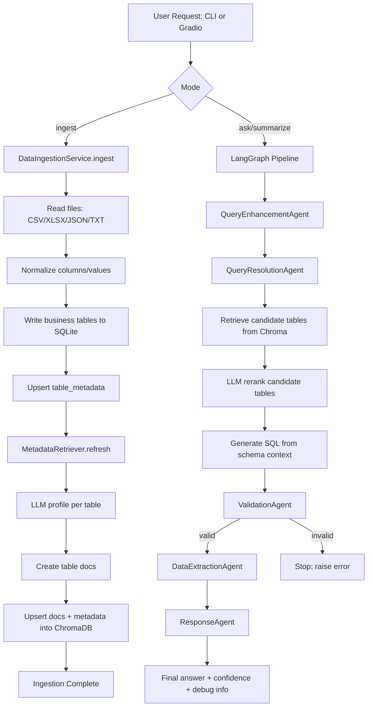
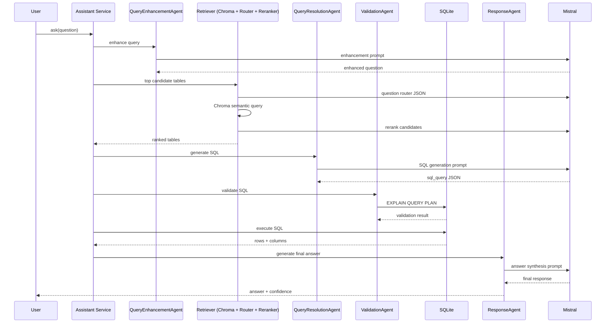

# Retail Insights Assistant

GenAI-powered retail analytics assistant for:

- Dataset ingestion from CSV, Excel, JSON, and TXT
- Natural-language Q&A over sales data
- Automated summary generation
- Multi-agent orchestration (LangGraph)
- Retrieval-augmented table selection (ChromaDB + embeddings)

---

## 1. System Overview

This project builds a conversational analytics assistant that converts business questions into SQL, executes SQL on SQLite, and returns grounded insights.

Core modes:

- `ingest`: Load data files into SQLite and build retrieval metadata
- `ask`: Ask ad-hoc business questions
- `summarize`: Get concise performance summaries
- `interactive`: Command-line chat loop
- `gradio_app.py`: Web UI for ingestion, summary, and Q&A

---

## 2. System Architecture
   
   ### Flowchart
```mermaid
   <!DOCTYPE html>
<html lang="en">
<head>
    <meta charset="UTF-8">
    <meta name="viewport" content="width=device-width, initial-scale=1.0">
    <title>Retail Insights System Architecture</title>
    <script src="https://cdn.jsdelivr.net/npm/mermaid@10/dist/mermaid.min.js"></script>
    <style>
        * {
            margin: 0;
            padding: 0;
            box-sizing: border-box;
        }

        body {
            font-family: -apple-system, BlinkMacSystemFont, 'Segoe UI', Roboto, Oxygen, Ubuntu, Cantarell, sans-serif;
            background: linear-gradient(135deg, #667eea 0%, #764ba2 100%);
            min-height: 100vh;
            padding: 20px;
        }

        .container {
            max-width: 1400px;
            margin: 0 auto;
            background: white;
            border-radius: 16px;
            box-shadow: 0 20px 60px rgba(0, 0, 0, 0.3);
            overflow: hidden;
        }

        .header {
            background: linear-gradient(135deg, #667eea 0%, #764ba2 100%);
            color: white;
            padding: 30px;
            text-align: center;
        }

        .header h1 {
            font-size: 2.5em;
            margin-bottom: 10px;
            font-weight: 700;
        }

        .header p {
            font-size: 1.1em;
            opacity: 0.95;
        }

        .tabs {
            display: flex;
            background: #f8f9fa;
            border-bottom: 2px solid #e9ecef;
        }

        .tab {
            flex: 1;
            padding: 20px;
            text-align: center;
            cursor: pointer;
            font-size: 1.1em;
            font-weight: 600;
            color: #6c757d;
            transition: all 0.3s ease;
            border-bottom: 3px solid transparent;
        }

        .tab:hover {
            background: #e9ecef;
            color: #495057;
        }

        .tab.active {
            color: #667eea;
            background: white;
            border-bottom-color: #667eea;
        }

        .diagram-container {
            display: none;
            padding: 40px;
            overflow-x: auto;
        }

        .diagram-container.active {
            display: block;
        }

        .diagram-wrapper {
            min-height: 600px;
            display: flex;
            justify-content: center;
            align-items: center;
        }

        .controls {
            display: flex;
            justify-content: center;
            gap: 15px;
            margin-bottom: 20px;
            flex-wrap: wrap;
        }

        .btn {
            padding: 10px 20px;
            border: none;
            border-radius: 8px;
            font-size: 0.95em;
            font-weight: 600;
            cursor: pointer;
            transition: all 0.3s ease;
            box-shadow: 0 2px 8px rgba(0, 0, 0, 0.1);
        }

        .btn-primary {
            background: #667eea;
            color: white;
        }

        .btn-primary:hover {
            background: #5568d3;
            transform: translateY(-2px);
            box-shadow: 0 4px 12px rgba(102, 126, 234, 0.4);
        }

        .btn-secondary {
            background: #6c757d;
            color: white;
        }

        .btn-secondary:hover {
            background: #5a6268;
            transform: translateY(-2px);
            box-shadow: 0 4px 12px rgba(108, 117, 125, 0.4);
        }

        .info-box {
            background: #e7f3ff;
            border-left: 4px solid #667eea;
            padding: 15px;
            margin-bottom: 20px;
            border-radius: 4px;
        }

        .info-box h3 {
            color: #667eea;
            margin-bottom: 8px;
            font-size: 1.1em;
        }

        .info-box p {
            color: #495057;
            line-height: 1.6;
        }

        .mermaid {
            text-align: center;
        }

        @media (max-width: 768px) {
            .header h1 {
                font-size: 1.8em;
            }
            
            .tab {
                padding: 15px 10px;
                font-size: 0.95em;
            }
            
            .diagram-container {
                padding: 20px;
            }
        }

        .footer {
            text-align: center;
            padding: 20px;
            color: #6c757d;
            background: #f8f9fa;
            border-top: 1px solid #e9ecef;
        }

        /* Zoom controls */
        #zoomLevel {
            display: inline-block;
            min-width: 60px;
            text-align: center;
            font-weight: 600;
            color: #495057;
        }
    </style>
</head>
<body>
    <div class="container">
        <div class="header">
            <h1>🏪 Retail Insights System Architecture</h1>
            <p>Interactive system flowchart and sequence diagrams</p>
        </div>

        <div class="tabs">
            <div class="tab active" onclick="switchTab('flowchart')">
                📊 System Flowchart
            </div>
            <div class="tab" onclick="switchTab('sequence')">
                🔄 Sequence Diagram
            </div>
        </div>

        <div id="flowchart" class="diagram-container active">
            <div class="info-box">
                <h3>System Flowchart Overview</h3>
                <p>This diagram shows the complete data flow from ingestion through query processing to response generation. It includes caching layers, storage components, and all agent interactions.</p>
            </div>

            <div class="controls">
                <button class="btn btn-primary" onclick="zoomIn('flowchart-diagram')">🔍 Zoom In</button>
                <button class="btn btn-primary" onclick="zoomOut('flowchart-diagram')">🔍 Zoom Out</button>
                <button class="btn btn-secondary" onclick="resetZoom('flowchart-diagram')">↺ Reset</button>
                <span id="zoomLevel">100%</span>
            </div>

            <div class="diagram-wrapper" id="flowchart-diagram">
                <div class="mermaid">
```
   
   ### Sequence Diagram
```mermaid
    </div>
            </div>
        </div>

        <div class="footer">
            <p>💡 Tip: Use zoom controls to explore details. Click nodes and connections for interactions.</p>
        </div>
    </div>

    <script>
        // Initialize Mermaid
        mermaid.initialize({ 
            startOnLoad: true,
            theme: 'default',
            flowchart: {
                useMaxWidth: true,
                htmlLabels: true,
                curve: 'basis'
            },
            sequence: {
                useMaxWidth: true,
                wrap: true
            }
        });

        // Zoom levels
        let flowchartZoom = 1;
        let sequenceZoom = 1;

        function switchTab(tabName) {
            // Remove active class from all tabs and containers
            document.querySelectorAll('.tab').forEach(tab => tab.classList.remove('active'));
            document.querySelectorAll('.diagram-container').forEach(container => container.classList.remove('active'));
            
            // Add active class to selected tab and container
            event.target.classList.add('active');
            document.getElementById(tabName).classList.add('active');
        }

        function zoomIn(diagramId) {
            const diagram = document.getElementById(diagramId);
            const isFlowchart = diagramId === 'flowchart-diagram';
            
            if (isFlowchart) {
                flowchartZoom = Math.min(flowchartZoom + 0.1, 2);
                diagram.style.transform = `scale(${flowchartZoom})`;
                document.getElementById('zoomLevel').textContent = Math.round(flowchartZoom * 100) + '%';
            } else {
                sequenceZoom = Math.min(sequenceZoom + 0.1, 2);
                diagram.style.transform = `scale(${sequenceZoom})`;
                document.getElementById('zoomLevel2').textContent = Math.round(sequenceZoom * 100) + '%';
            }
            
            diagram.style.transformOrigin = 'center top';
            diagram.style.transition = 'transform 0.3s ease';
        }

        function zoomOut(diagramId) {
            const diagram = document.getElementById(diagramId);
            const isFlowchart = diagramId === 'flowchart-diagram';
            
            if (isFlowchart) {
                flowchartZoom = Math.max(flowchartZoom - 0.1, 0.5);
                diagram.style.transform = `scale(${flowchartZoom})`;
                document.getElementById('zoomLevel').textContent = Math.round(flowchartZoom * 100) + '%';
            } else {
                sequenceZoom = Math.max(sequenceZoom - 0.1, 0.5);
                diagram.style.transform = `scale(${sequenceZoom})`;
                document.getElementById('zoomLevel2').textContent = Math.round(sequenceZoom * 100) + '%';
            }
            
            diagram.style.transformOrigin = 'center top';
            diagram.style.transition = 'transform 0.3s ease';
        }

        function resetZoom(diagramId) {
            const diagram = document.getElementById(diagramId);
            const isFlowchart = diagramId === 'flowchart-diagram';
            
            if (isFlowchart) {
                flowchartZoom = 1;
                document.getElementById('zoomLevel').textContent = '100%';
            } else {
                sequenceZoom = 1;
                document.getElementById('zoomLevel2').textContent = '100%';
            }
            
            diagram.style.transform = 'scale(1)';
            diagram.style.transition = 'transform 0.3s ease';
        }

        // Add keyboard shortcuts
        document.addEventListener('keydown', function(e) {
            const activeContainer = document.querySelector('.diagram-container.active');
            const diagramId = activeContainer.id === 'flowchart' ? 'flowchart-diagram' : 'sequence-diagram';
            
            if (e.ctrlKey || e.metaKey) {
                if (e.key === '=' || e.key === '+') {
                    e.preventDefault();
                    zoomIn(diagramId);
                } else if (e.key === '-') {
                    e.preventDefault();
                    zoomOut(diagramId);
                } else if (e.key === '0') {
                    e.preventDefault();
                    resetZoom(diagramId);
                }
            }
        });
    </script>
</body>
</html>
```



### Query-Time Sequence



---

## 3. Project Structure

```text
main/
|-- main.py
|-- gradio_app.py
|-- requirements.txt
|-- retail_insights.db                 # created at runtime
|-- chroma_db/                         # created at runtime
|-- retail_insights/
|   |-- agents.py
|   |-- cache.py
|   |-- config.py
|   |-- graph.py
|   |-- ingestion.py
|   |-- llm.py
|   |-- memory.py
|   |-- monitoring.py
|   |-- prompts.py
|   |-- retrieval.py
|   `-- sqlite_utils.py
|-- spark/
|   |-- ingest_pyspark.py
|   `-- lakehouse_delta.py
`-- README.md
```

---

## 4. Setup Instructions

### 4.1 Clone Repository

```bash
git clone <your-repo-url>
cd retail_insights_engine/main
```

### 4.2 Create Virtual Environment

```bash
python3 -m venv .venv
source .venv/bin/activate
```

### 4.3 Install Dependencies

```bash
pip install -r requirements.txt
```

Current `requirements.txt` includes:

- pandas
- openpyxl
- mistralai
- langgraph
- numpy
- python-dotenv
- gradio
- chromadb
- sentence-transformers

### 4.4 Environment Variables

Create `.env` in project root:

```env
MISTRAL_API_KEY=your_api_key_here
MISTRAL_MODEL=mistral-medium-latest
SQLITE_DB_PATH=./retail_insights.db
CHROMA_PERSIST_PATH=./chroma_db
EMBEDDING_MODEL_NAME=Alibaba-NLP/gte-large-en-v1.5
LLM_TEMPERATURE=0.2
MAX_SQL_ROWS=200
MEMORY_TURNS=8
```

---

## 5. Run Instructions (CLI)

All commands from project root.

### 5.1 Ingest Data

```bash
python3 main.py --db-path ./retail_insights.db ingest --input-path "/path/to/data/folder_or_file"
```

Example:

```bash
python3 main.py --db-path ./retail_insights.db ingest --input-path "/home/ntlpt19/personal_projects/sales_rag/Sales Dataset/Sales Dataset"
```

### 5.2 Ask a Question

```bash
python3 main.py --db-path ./retail_insights.db ask --conversation-id demo --question "Which product line underperformed in Q4?"
```

### 5.3 Ask with Debug

```bash
python3 main.py --db-path ./retail_insights.db ask --conversation-id demo --question "Top categories by revenue in April" --debug
```

### 5.4 Summarization Mode

```bash
python3 main.py --db-path ./retail_insights.db summarize --conversation-id demo
```

Custom summary prompt:

```bash
python3 main.py --db-path ./retail_insights.db summarize --conversation-id demo --prompt "Summarize YoY regional sales performance." --debug
```

### 5.5 Interactive Shell

```bash
python3 main.py --db-path ./retail_insights.db interactive --conversation-id demo --debug
```

---

## 6. Run Instructions (Gradio UI)

```bash
python3 gradio_app.py
```

Then open the local URL shown in terminal (usually `http://127.0.0.1:7860`).

Tabs available:

- Ingestion
- Summarization
- Q&A

---

## 7. Debug Output Contents

When `--debug` is enabled, output includes:

- Retrieval diagnostics (`candidate_tables`, retrieval method, rerank info)
- Query SQL prompt (system and user prompt)
- Generated and validated SQL
- Raw SQL output (`columns`, `rows`, `row_count`)
- Final answer prompt

---

## 8. Data and Storage Details

### SQLite Tables

- Business tables generated from ingested files
- System tables:
  - `table_metadata`
  - `conversation_turns`
  - `llm_cache`
  - `table_profile_cache`

### ChromaDB

- Persistent path: `./chroma_db` (configurable)
- Collection: schema/table profile docs used for table retrieval

---

## 9. Optional 100GB+ Scaling Path

For large-scale historical data:

- Ingestion/cleaning with PySpark (`spark/ingest_pyspark.py`)
- Storage in Parquet/Delta (`spark/lakehouse_delta.py`)
- Analytical queries on Spark SQL
- Keep SQLite as lightweight serving cache for interactive use
- Keep Chroma indexing at table/profile level (not full-row embeddings)

---

## 10. Troubleshooting

- `MISTRAL_API_KEY is required`
  - Ensure `.env` contains valid API key
- JSON parse errors from LLM
  - Check prompt output format and run with `--debug`
- No candidate tables from retrieval
  - Re-run `ingest`; ensure retriever refresh completed
- First run is slow
  - Embedding model download may take time

---

## 11. Quick Start (Minimal)

```bash
python3 -m venv .venv
source .venv/bin/activate
pip install -r requirements.txt

# set MISTRAL_API_KEY in .env

python3 main.py --db-path ./retail_insights.db ingest --input-path "/path/to/data"
python3 main.py --db-path ./retail_insights.db ask --conversation-id demo --question "Which category had highest sales in April?" --debug
```

---

## 12. Setup and Execution Guide

### Step 1: Environment setup

```bash
git clone <your-repo-url>
cd retail_insights_engine/main
python3 -m venv .venv
source .venv/bin/activate
pip install -r requirements.txt
```

### Step 2: Configure secrets and runtime vars

Create `.env`:

```env
MISTRAL_API_KEY=your_api_key_here
MISTRAL_MODEL=mistral-medium-latest
SQLITE_DB_PATH=./retail_insights.db
CHROMA_PERSIST_PATH=./chroma_db
EMBEDDING_MODEL_NAME=Alibaba-NLP/gte-large-en-v1.5
```

### Step 3: Ingest data

```bash
python3 main.py --db-path ./retail_insights.db ingest --input-path "/path/to/data"
```

### Step 4: Run query workflows

Ask:

```bash
python3 main.py --db-path ./retail_insights.db ask --conversation-id demo --question "Which product line underperformed in Q4?" --debug
```

Summarize:

```bash
python3 main.py --db-path ./retail_insights.db summarize --conversation-id demo --debug
```

Interactive shell:

```bash
python3 main.py --db-path ./retail_insights.db interactive --conversation-id demo --debug
```

### Step 5: Launch web UI

```bash
python3 gradio_app.py
```

Open the local Gradio URL shown in terminal.

---

## 13. Assumptions, Limitations, and Possible Improvements

### Assumptions

- Input files are business tables that can be loaded as flat tabular data.
- Mistral API is available and `MISTRAL_API_KEY` is configured.
- Date fields in key sales tables commonly follow `MM-DD-YY` string format unless schema indicates otherwise.
- Table-level retrieval is sufficient for selecting relevant sources before SQL generation.

### Limitations

- Query accuracy depends on LLM output quality and schema clarity.
- Strict fail-fast behavior stops execution on malformed LLM JSON/SQL (good for safety, but less forgiving UX).
- Gradio app currently exposes core workflows but does not include advanced admin/monitoring controls.

### Possible Improvements

- Add optional guarded fallback path (config-driven) for non-critical environments.
- Add SQL unit/e2e test suite with golden query-answer cases.
- Add evaluation dashboard for retrieval precision, SQL validity rate, and latency percentiles.
- Introduce hybrid retrieval (metadata filter + semantic + rule-based constraints).
- Introduce Human-in-the-Loop (HITL) feedback environment where validated answers are reviewed and approved; approved query–SQL–answer pairs are persisted as table-linked Q&A exemplars in ChromaDB to continuously improve future table selection, routing accuracy, and retrieval precision.