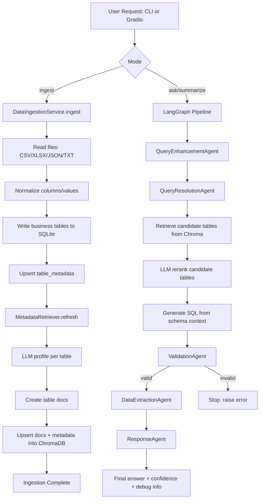
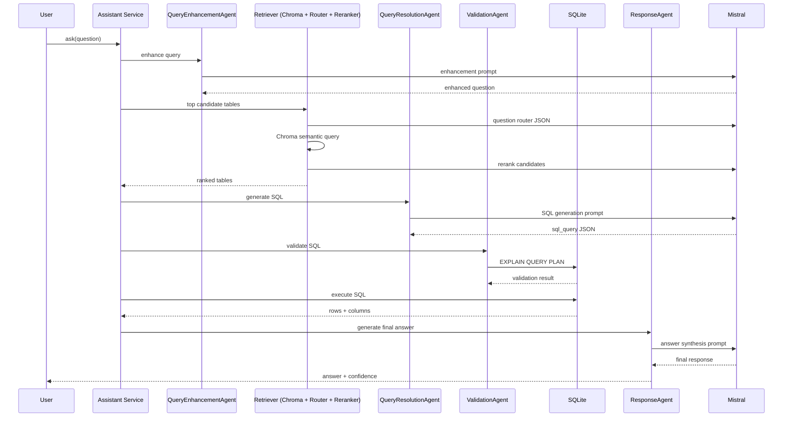

# Retail Insights Assistant

GenAI-powered retail analytics assistant for:

- Dataset ingestion from CSV, Excel, JSON, and TXT
- Natural-language Q&A over sales data
- Automated summary generation
- Multi-agent orchestration (LangGraph)
- Retrieval-augmented table selection (ChromaDB + embeddings)

---

## 1. System Overview

This project builds a conversational analytics assistant that converts business questions into SQL, executes SQL on SQLite, and returns grounded insights.

Core modes:

- `ingest`: Load data files into SQLite and build retrieval metadata
- `ask`: Ask ad-hoc business questions
- `summarize`: Get concise performance summaries
- `interactive`: Command-line chat loop
- `gradio_app.py`: Web UI for ingestion, summary, and Q&A

---

## 2. Architecture and Data Flow



### Query-Time Sequence



---

## 3. Project Structure

```text
main/
|-- main.py
|-- gradio_app.py
|-- requirements.txt
|-- retail_insights.db                 # created at runtime
|-- chroma_db/                         # created at runtime
|-- retail_insights/
|   |-- agents.py
|   |-- cache.py
|   |-- config.py
|   |-- graph.py
|   |-- ingestion.py
|   |-- llm.py
|   |-- memory.py
|   |-- monitoring.py
|   |-- prompts.py
|   |-- retrieval.py
|   `-- sqlite_utils.py
|-- spark/
|   |-- ingest_pyspark.py
|   `-- lakehouse_delta.py
`-- README.md
```

---

## 4. Setup Instructions

### 4.1 Clone Repository

```bash
git clone <your-repo-url>
cd retail_insights_engine/main
```

### 4.2 Create Virtual Environment

```bash
python3 -m venv .venv
source .venv/bin/activate
```

### 4.3 Install Dependencies

```bash
pip install -r requirements.txt
```

Current `requirements.txt` includes:

- pandas
- openpyxl
- mistralai
- langgraph
- numpy
- python-dotenv
- gradio
- chromadb
- sentence-transformers

### 4.4 Environment Variables

Create `.env` in project root:

```env
MISTRAL_API_KEY=your_api_key_here
MISTRAL_MODEL=mistral-medium-latest
SQLITE_DB_PATH=./retail_insights.db
CHROMA_PERSIST_PATH=./chroma_db
EMBEDDING_MODEL_NAME=Alibaba-NLP/gte-large-en-v1.5
LLM_TEMPERATURE=0.2
MAX_SQL_ROWS=200
MEMORY_TURNS=8
```

---

## 5. Run Instructions (CLI)

All commands from project root.

### 5.1 Ingest Data

```bash
python3 main.py --db-path ./retail_insights.db ingest --input-path "/path/to/data/folder_or_file"
```

Example:

```bash
python3 main.py --db-path ./retail_insights.db ingest --input-path "/home/ntlpt19/personal_projects/sales_rag/Sales Dataset/Sales Dataset"
```

### 5.2 Ask a Question

```bash
python3 main.py --db-path ./retail_insights.db ask --conversation-id demo --question "Which product line underperformed in Q4?"
```

### 5.3 Ask with Debug

```bash
python3 main.py --db-path ./retail_insights.db ask --conversation-id demo --question "Top categories by revenue in April" --debug
```

### 5.4 Summarization Mode

```bash
python3 main.py --db-path ./retail_insights.db summarize --conversation-id demo
```

Custom summary prompt:

```bash
python3 main.py --db-path ./retail_insights.db summarize --conversation-id demo --prompt "Summarize YoY regional sales performance." --debug
```

### 5.5 Interactive Shell

```bash
python3 main.py --db-path ./retail_insights.db interactive --conversation-id demo --debug
```

---

## 6. Run Instructions (Gradio UI)

```bash
python3 gradio_app.py
```

Then open the local URL shown in terminal (usually `http://127.0.0.1:7860`).

Tabs available:

- Ingestion
- Summarization
- Q&A

---

## 7. Debug Output Contents

When `--debug` is enabled, output includes:

- Retrieval diagnostics (`candidate_tables`, retrieval method, rerank info)
- Query SQL prompt (system and user prompt)
- Generated and validated SQL
- Raw SQL output (`columns`, `rows`, `row_count`)
- Final answer prompt

---

## 8. Data and Storage Details

### SQLite Tables

- Business tables generated from ingested files
- System tables:
  - `table_metadata`
  - `conversation_turns`
  - `llm_cache`
  - `table_profile_cache`

### ChromaDB

- Persistent path: `./chroma_db` (configurable)
- Collection: schema/table profile docs used for table retrieval

---

## 9. Optional 100GB+ Scaling Path

For large-scale historical data:

- Ingestion/cleaning with PySpark (`spark/ingest_pyspark.py`)
- Storage in Parquet/Delta (`spark/lakehouse_delta.py`)
- Analytical queries on Spark SQL
- Keep SQLite as lightweight serving cache for interactive use
- Keep Chroma indexing at table/profile level (not full-row embeddings)

---

## 10. Troubleshooting

- `MISTRAL_API_KEY is required`
  - Ensure `.env` contains valid API key
- JSON parse errors from LLM
  - Check prompt output format and run with `--debug`
- No candidate tables from retrieval
  - Re-run `ingest`; ensure retriever refresh completed
- First run is slow
  - Embedding model download may take time

---

## 11. Quick Start (Minimal)

```bash
python3 -m venv .venv
source .venv/bin/activate
pip install -r requirements.txt

# set MISTRAL_API_KEY in .env

python3 main.py --db-path ./retail_insights.db ingest --input-path "/path/to/data"
python3 main.py --db-path ./retail_insights.db ask --conversation-id demo --question "Which category had highest sales in April?" --debug
```

---

## 12. Setup and Execution Guide

### Step 1: Environment setup

```bash
git clone <your-repo-url>
cd retail_insights_engine/main
python3 -m venv .venv
source .venv/bin/activate
pip install -r requirements.txt
```

### Step 2: Configure secrets and runtime vars

Create `.env`:

```env
MISTRAL_API_KEY=your_api_key_here
MISTRAL_MODEL=mistral-medium-latest
SQLITE_DB_PATH=./retail_insights.db
CHROMA_PERSIST_PATH=./chroma_db
EMBEDDING_MODEL_NAME=Alibaba-NLP/gte-large-en-v1.5
```

### Step 3: Ingest data

```bash
python3 main.py --db-path ./retail_insights.db ingest --input-path "/path/to/data"
```

### Step 4: Run query workflows

Ask:

```bash
python3 main.py --db-path ./retail_insights.db ask --conversation-id demo --question "Which product line underperformed in Q4?" --debug
```

Summarize:

```bash
python3 main.py --db-path ./retail_insights.db summarize --conversation-id demo --debug
```

Interactive shell:

```bash
python3 main.py --db-path ./retail_insights.db interactive --conversation-id demo --debug
```

### Step 5: Launch web UI

```bash
python3 gradio_app.py
```

Open the local Gradio URL shown in terminal.

---

## 13. Assumptions, Limitations, and Possible Improvements

### Assumptions

- Input files are business tables that can be loaded as flat tabular data.
- Mistral API is available and `MISTRAL_API_KEY` is configured.
- Date fields in key sales tables commonly follow `MM-DD-YY` string format unless schema indicates otherwise.
- Table-level retrieval is sufficient for selecting relevant sources before SQL generation.

### Limitations

- Query accuracy depends on LLM output quality and schema clarity.
- Strict fail-fast behavior stops execution on malformed LLM JSON/SQL (good for safety, but less forgiving UX).
- Gradio app currently exposes core workflows but does not include advanced admin/monitoring controls.

### Possible Improvements

- Add optional guarded fallback path (config-driven) for non-critical environments.
- Add SQL unit/e2e test suite with golden query-answer cases.
- Add evaluation dashboard for retrieval precision, SQL validity rate, and latency percentiles.
- Introduce hybrid retrieval (metadata filter + semantic + rule-based constraints).
- Introduce Human-in-the-Loop (HITL) feedback environment where validated answers are reviewed and approved; approved query–SQL–answer pairs are persisted as table-linked Q&A exemplars in ChromaDB to continuously improve future table selection, routing accuracy, and retrieval precision.