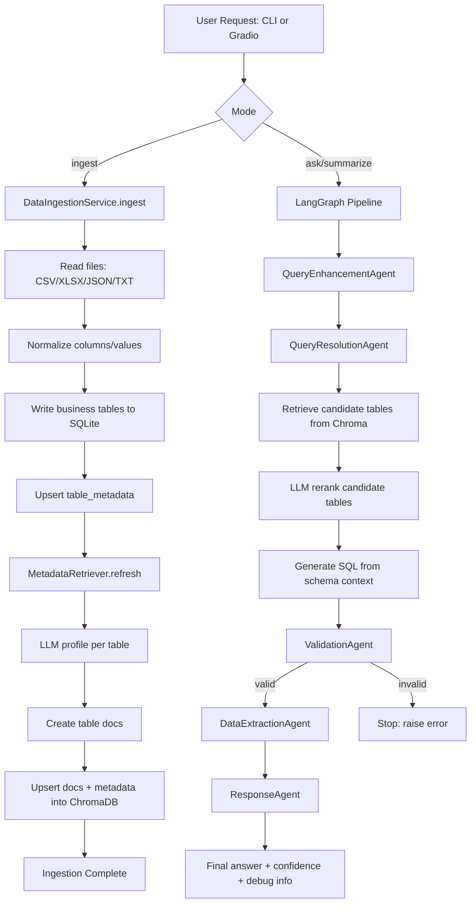
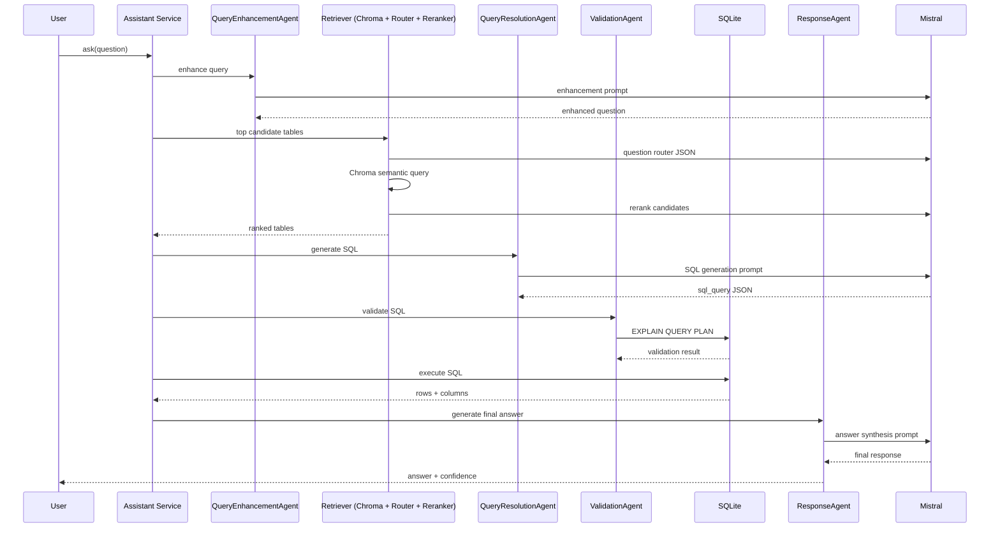

# Retail Insights Assistant

GenAI-powered retail analytics assistant for:

- Dataset ingestion from CSV, Excel, JSON, and TXT
- Natural-language Q&A over sales data
- Automated summary generation
- Multi-agent orchestration (LangGraph)
- Retrieval-augmented table selection (ChromaDB + embeddings)

---

## 1. System Overview

This project converts business questions into SQL, executes SQL on SQLite, and returns grounded business insights.

Core modes:

- `ingest`: Load files into SQLite and refresh retrieval index
- `ask`: Ad-hoc business Q&A
- `summarize`: Concise performance summary
- `interactive`: CLI chat loop
- `gradio_app.py`: Web UI for ingestion, summary, and Q&A

---

## 2. System Architecture

### Flowchart



### Sequence Diagram



---

## 3. Project Structure

```text
retail_insights_engine/
|-- README.md
`-- main/
    |-- main.py
    |-- gradio_app.py
    |-- requirements.txt
    |-- retail_insights/
    |   |-- agents.py
    |   |-- cache.py
    |   |-- config.py
    |   |-- graph.py
    |   |-- ingestion.py
    |   |-- llm.py
    |   |-- memory.py
    |   |-- monitoring.py
    |   |-- prompts.py
    |   |-- retrieval.py
    |   `-- sqlite_utils.py
    `-- spark/
        |-- ingest_pyspark.py
        `-- lakehouse_delta.py
```

---

## 4. Setup and Execution Guide

### 4.1 Clone

```bash
git clone <your-repo-url>
cd retail_insights_engine/main
```

### 4.2 Create environment

```bash
python3 -m venv .venv
source .venv/bin/activate
```

### 4.3 Install dependencies

```bash
pip install -r requirements.txt
```

### 4.4 Configure `.env`

```env
MISTRAL_API_KEY=your_api_key_here
MISTRAL_MODEL=mistral-medium-latest
SQLITE_DB_PATH=./retail_insights.db
CHROMA_PERSIST_PATH=./chroma_db
EMBEDDING_MODEL_NAME=Alibaba-NLP/gte-large-en-v1.5
LLM_TEMPERATURE=0.2
MAX_SQL_ROWS=200
MEMORY_TURNS=8
```

### 4.5 Ingest data

```bash
python3 main.py --db-path ./retail_insights.db ingest --input-path "/path/to/data"
```

### 4.6 Ask a question

```bash
python3 main.py --db-path ./retail_insights.db ask --conversation-id demo --question "Which product line underperformed in Q4?" --debug
```

### 4.7 Summarize

```bash
python3 main.py --db-path ./retail_insights.db summarize --conversation-id demo --debug
```

### 4.8 Interactive CLI

```bash
python3 main.py --db-path ./retail_insights.db interactive --conversation-id demo --debug
```

### 4.9 Run Gradio UI

```bash
python3 gradio_app.py
```

Then open the local URL printed in terminal.

---

## 5. Assumptions, Limitations, and Possible Improvements

### Assumptions

- Input datasets are mostly tabular and can be loaded as flat tables.
- Mistral API access is available and correctly configured.
- Date columns in major sales tables commonly use `MM-DD-YY` text format unless schema suggests otherwise.
- Table-level retrieval is sufficient for selecting relevant sources before SQL generation.

### Limitations

- SQLite is good for local/medium workloads, but not ideal as primary engine for very large interactive analytics.
- SQL and answer quality still depends on LLM output quality and schema clarity.
- Current pipeline is strict fail-fast: malformed LLM JSON/SQL stops execution.
- Gradio UI is minimal and does not include full admin/monitoring controls.

### Possible Improvements

- Add optional guarded fallback mode via config for non-critical environments.
- Add SQL regression tests and benchmark suite.
- Add evaluation dashboard for retrieval precision, SQL validity rate, and latency.
- Integrate Spark/Delta as primary engine for 100GB+ workloads; keep SQLite as serving cache.
- Add enterprise controls: auth, RBAC, audit logs, and rate limits.

---

## 6. Troubleshooting

- `MISTRAL_API_KEY is required`
  - Set API key in `.env`.
- JSON parse or strict-output failures
  - Run with `--debug` and inspect prompt/response traces.
- Empty retrieval candidates
  - Re-run ingestion and ensure retriever index refresh completes.
- Slow first run
  - Embedding model may download on first use.
